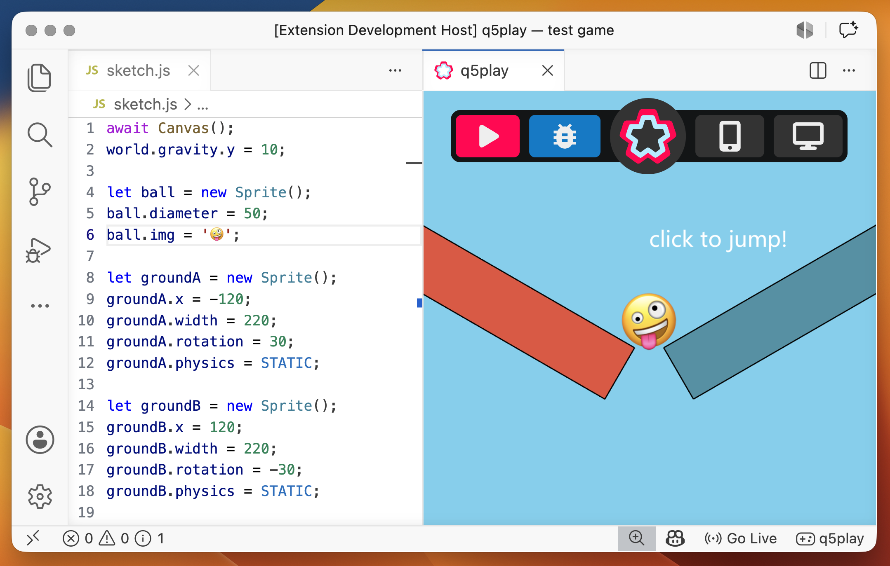

# q5play VSCode

Use this extension to easily create and run q5play projects in Visual Studio Code.

## Create a new q5play project

1. Open a new window in Visual Studio Code
2. Find "q5play" in the bottom status bar and click it.
3. When the q5play tab opens, click "Create a new q5play project"
4. Enter the name of the project and then select the destination folder.
5. Happy coding! 🎉😃🎮

The [q5play-template](https://github.com/q5play/q5play-template) folder contains a basic q5play project that you can run offline.

## Video Demonstration

<video controls width="800">
  <source src="https://raw.githubusercontent.com/q5play/q5play-assets/main/q5play_vscode.mp4" type="video/mp4">
  

    <a href="https://github.com/q5play/q5play-assets/blob/main/q5play_vscode.mp4">Watch the video demo</a>
  

</video>

## Run your project

If you have a q5play project folder open in VSCode, simply click "q5play" in the bottom status bar. A live server will start and your project will run inside the q5play tab.

Click the play icon in the nav or save any changes to your project files to re-run your project.

## Debug

Click the debug icon in the nav to open the VSCode Dev Tools panel, which is just like the one in Chrome.

## View on Mobile

Click the mobile icon in nav to generate a QR code. Scan it with your phone camera to run your project with your phone's web browser!

## View in Browser

Click the browser icon in the nav to open your project in your default web browser.

## Command Palette Usage

Alternatively, you can use the VSCode command palette, open with `Ctrl+Shift+P` or `Cmd+Shift+P`, and start by typing `q5play`.

Available commands:

- "q5play: New Project"
- "q5play: Open Runner"

## Development

Run and debug the extension using Visual Studio Code.

To package the extension, run `vsce package` and then `vsce publish` in the terminal.
